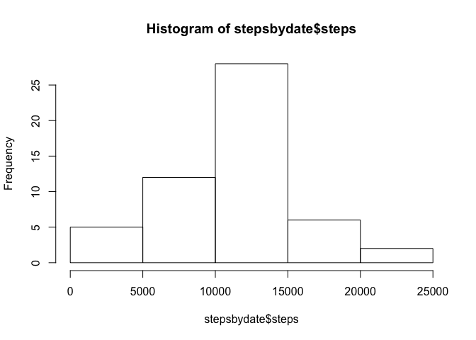
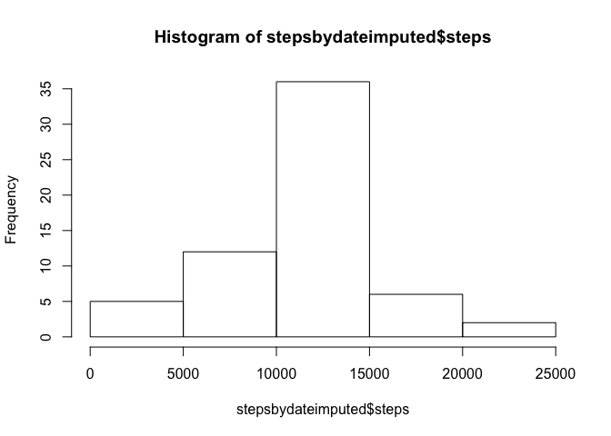

## Loading and preprocessing the data
Load the date, and change the dates to actual dates.

```r
x<-read.csv("activity.csv")
x$date<-as.Date(as.character(x$date))
options(scipen=999)
```

## What is mean total number of steps taken per day?


```r
stepsbydate<-aggregate( steps ~ date, x, sum )
hist(stepsbydate$steps)
```

<!-- -->

```r
stepmean<-format(summary(stepsbydate$steps)[4],digits = 1)
stepmedian<-format(summary(stepsbydate$steps)[3],digits = 1)
```

The mean number of steps per day is 10766 and the median is 10765.

## What is the average daily activity pattern?


```r
stepsbytime<-aggregate( steps ~ interval, x, mean )
plot(stepsbytime, type="l")
```

<!-- -->

```r
maxstepsinterval<-stepsbytime$interval[which.max(stepsbytime$steps)]
```
The maximum average steps occurred during interval 835.

## Imputing missing values


```r
numnas<-summary(x$steps)["NA's"]
ximputed<-x
naintervals<-ximputed$interval[is.na(ximputed$steps)]
naintervalmatches<-match(naintervals, stepsbytime$interval)
ximputed$steps[is.na(ximputed$steps)]<-stepsbytime$steps[naintervalmatches]

stepsbydateimputed<-aggregate( steps ~ date, ximputed, sum )
stepmeanimputed<-format(summary(stepsbydateimputed$steps)[4],digits = 1)
stepmedianimputed<-format(summary(stepsbydateimputed$steps)[3],digits = 1)
hist(stepsbydateimputed$steps)
```

<!-- -->

There are 2304 missing values.
The new mean steps per day is 10766 and the median is 10766. 

## Are there differences in activity patterns between weekdays and weekends?

```r
library(lattice)
weekdayholder<-weekdays(ximputed$date)
weekendholder<-weekdayholder=="Saturday" | weekdayholder=="Sunday"
ximputed$weekend<-as.factor(weekendholder)
levels(ximputed$weekend)<-c("weekday", "weekend")
stepsbytimeweekend<-aggregate( steps ~ interval + weekend, ximputed, mean )
xyplot(steps ~ interval | weekend, data = stepsbytimeweekend, type="l", layout=c(1,2))
```

<!-- -->

